# JGAN

Code based on [Pytorch-GAN](https://github.com/eriklindernoren/PyTorch-GAN)

Our GAN model zoo supports 27 kinds of GAN.
This table is the latest citations we found from Google Scholar.
It can be seen that since GAN was proposed in 2014, a lot of excellent work based on GAN has appeared.
These 27 GANs have a total of 60953 citations, with an average of 2176 citations per article.

我们的 GAN 模型库支持 27 种 GAN 模型。该表是我们从 Google Scholar 中找到的最新引用量。可以看到，自 2014 年提出 GAN 以来，出现了很多基于 GAN 的优秀工作。这 27 个 GAN 模型总共有 60953 次引用，平均每篇文章被引用 2176 次。

<p align="center">
    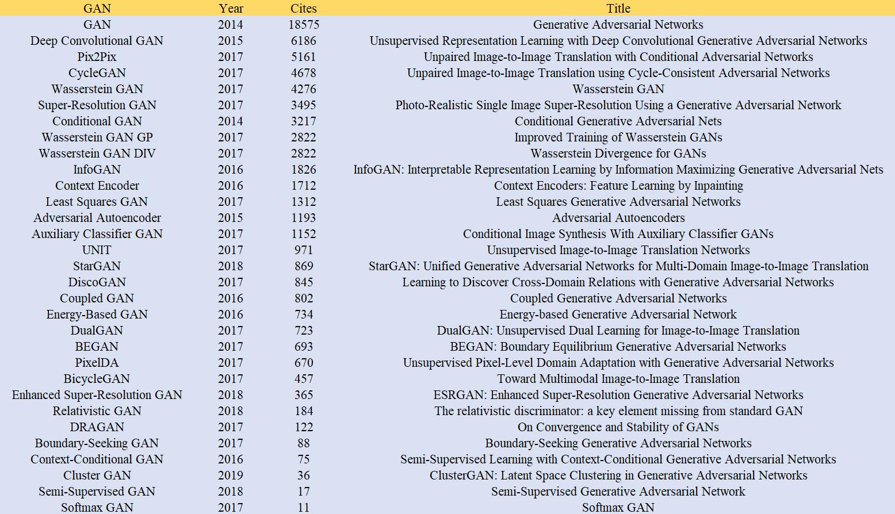
</p>

We compared the performance of these GANs of Jittor and Pytorch. The PyTorch version code uses the commit a163b8 on August 24, 2019 of the master branch of [github repository](https://github.com/eriklindernoren/PyTorch-GAN). The picture below is the speedup ratio of Jittor relative to Pytorch. It can be seen that the highest acceleration ratio of these GANs reaches 283%, and the average acceleration ratio is 185%.

我们比较了 Jittor 和 Pytorch 的这些 GAN 模型的性能。PyTorch 版本代码使用 [github 仓库](https://github.com/eriklindernoren/PyTorch-GAN) master 分支 2019 年 8 月 24 日的 commit a163b8。下图是 Jittor 相对于 Pytorch 的加速比。可以看出，这些GANs的最高加速比达到283%，平均加速比为185%。

<p align="center">
    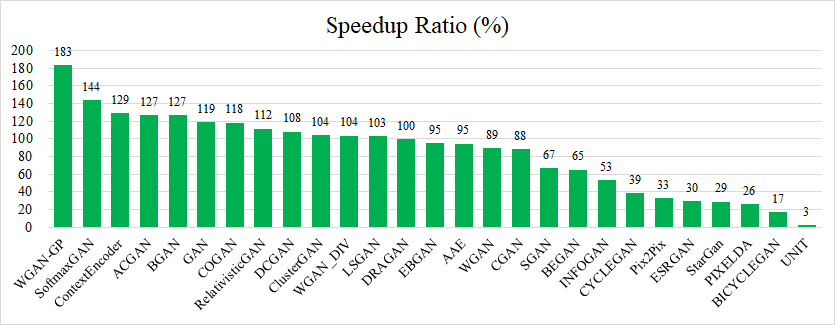
</p>

In another form of presentation, assuming that Pytorch's training time is 100 hours, we calculated the time required for GAN training corresponding to Jittor. Of these GANs, our fastest accelerating GAN takes only 35 hours to run, with an average of 57 hours.

以另一种形式的呈现，假设 Pytorch 的训练时间为 100 小时，我们计算了 Jittor 对应的 GAN 训练所需的时间。在这些 GAN 中，我们最快的加速 GAN 仅需 35 小时即可运行，平均为 57 小时。

<p align="center">
    
</p>


## News

* 第二届计图人工智能挑战赛已于 2022/04/15 正式开启。
    + 计图 (Jittor) 人工智能算法挑战赛是在国家自然科学基金委信息科学部指导下，由北京信息科学与技术国家研究中心和清华大学-腾讯互联网创新技术联合实验室于 2021 年创办、基于清华大学“计图”深度学习框架的人工智能算法大赛。今年起，该赛事将作为中国软件开源创新大赛中开源任务挑战赛的赛事之一开展 AI 算竞赛。
    + 大赛面向所有在校学生和 AI 相关领域从业人士开放，旨在通过竞技的方式提升人们对数据分析与处理的算法研究与技术应用的能力，推动我国自主人工智能平台的生态建设和人工智能研究和应用的深入。竞赛得到腾讯公司的赞助。
    + 本届挑战赛设置一个热身赛（手写数字生成赛题）和两个正式赛题（风景图片生成赛题和可微渲染新视角生成赛题），参赛选手需要通过热身赛才能参加两个正式赛题。比赛更多信息可以在[官网](https://www.educoder.net/competitions/index/Jittor-3)查看。其中计图挑战热身赛和赛题一：风景图片生成赛题可以详见[这里](https://github.com/Jittor/JGAN/tree/master/competition/readme.md)。

## Table of Contents
  * [Installation](#installation)
  * [models](#models)
    + [Auxiliary Classifier GAN](#auxiliary-classifier-gan)
    + [Adversarial Autoencoder](#adversarial-autoencoder)
    + [BEGAN](#began)
    + [BicycleGAN](#bicyclegan)
    + [Boundary-Seeking GAN](#boundary-seeking-gan)
    + [Cluster GAN](#cluster-gan)
    + [Conditional GAN](#conditional-gan)
    + [Context Encoder](#context-encoder)
    + [Coupled GAN](#coupled-gan)
    + [CycleGAN](#cyclegan)
    + [Deep Convolutional GAN](#deep-convolutional-gan)
    + [DRAGAN](#dragan)
    + [Energy-Based GAN](#energy-based-gan)
    + [Enhanced Super-Resolution GAN](#enhanced-super-resolution-gan)
    + [GAN](#gan)
    + [InfoGAN](#infogan)
    + [Least Squares GAN](#least-squares-gan)
    + [Pix2Pix](#pix2pix)
    + [PixelDA](#pixelda)
    + [Relativistic GAN](#relativistic-gan)
    + [Semi-Supervised GAN](#semi-supervised-gan)
    + [Softmax GAN](#softmax-gan)
    + [StarGAN](#stargan)
    + [UNIT](#unit)
    + [Wasserstein GAN](#wasserstein-gan)
    + [Wasserstein GAN GP](#wasserstein-gan-gp)
    + [Wasserstein GAN DIV](#wasserstein-gan-div)
    + [StyleGAN](https://github.com/xUhEngwAng/StyleGAN-jittor)

## Installation
    $ git clone https://github.com/Jittor/JGAN.git
    $ cd JGAN/
    $ sudo python3.7 -m pip install -r requirements.txt

## models   
### Auxiliary Classifier GAN
_Auxiliary Classifier Generative Adversarial Network_

#### Authors
Augustus Odena, Christopher Olah, Jonathon Shlens

[[Paper]](https://arxiv.org/abs/1610.09585) [[Code]](models/acgan/acgan.py)

#### Run Example
```
$ cd models/acgan/
$ python3.7 acgan.py
```

<p align="center">

</p>

### Adversarial Autoencoder
_Adversarial Autoencoder_

#### Authors
Alireza Makhzani, Jonathon Shlens, Navdeep Jaitly, Ian Goodfellow, Brendan Frey

[[Paper]](https://arxiv.org/abs/1511.05644) [[Code]](models/aae/aae.py)

#### Run Example
```
$ cd models/aae/
$ python3.7 aae.py
```

<p align="center">
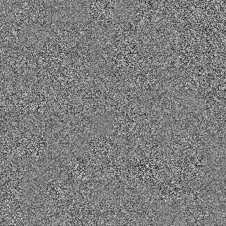
</p>

### BEGAN
_BEGAN: Boundary Equilibrium Generative Adversarial Networks_

#### Authors
David Berthelot, Thomas Schumm, Luke Metz

[[Paper]](https://arxiv.org/abs/1703.10717) [[Code]](models/began/began.py)

#### Run Example
```
$ cd models/began/
$ python3.7 began.py
```

<p align="center">
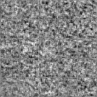
</p>

### BicycleGAN
_Toward Multimodal Image-to-Image Translation_

#### Authors
Jun-Yan Zhu, Richard Zhang, Deepak Pathak, Trevor Darrell, Alexei A. Efros, Oliver Wang, Eli Shechtman

[[Paper]](https://arxiv.org/abs/1711.11586) [[Code]](models/bicyclegan/bicyclegan.py)

#### Run Example
```
$ cd data/
$ bash download_pix2pix_dataset.sh edges2shoes
$ cd ../models/bicyclegan/
$ python3.7 bicyclegan.py
```

<p align="center">
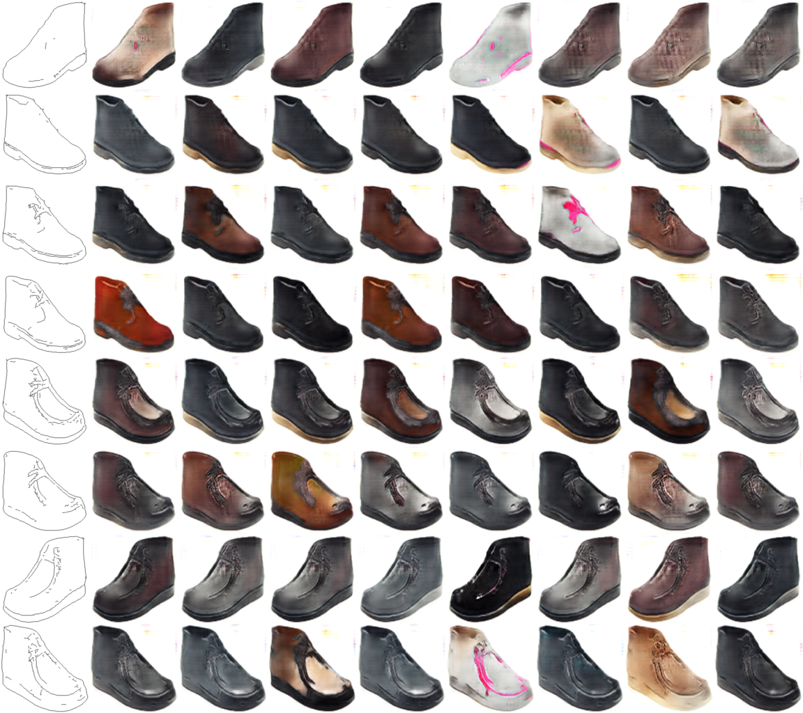
</p>
<p align="center">
    Various style translations by varying the latent code.
</p>


### Boundary-Seeking GAN
_Boundary-Seeking Generative Adversarial Networks_

#### Authors
R Devon Hjelm, Athul Paul Jacob, Tong Che, Adam Trischler, Kyunghyun Cho, Yoshua Bengio

[[Paper]](https://arxiv.org/abs/1702.08431) [[Code]](models/bgan/bgan.py)

#### Run Example
```
$ cd models/bgan/
$ python3.7 bgan.py
```

<p align="center">
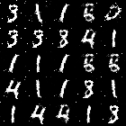
</p>

### Cluster GAN

_ClusterGAN: Latent Space Clustering in Generative Adversarial Networks_

#### Authors
Sudipto Mukherjee, Himanshu Asnani, Eugene Lin, Sreeram Kannan

[[Paper]](https://arxiv.org/abs/1809.03627) [[Code]](models/cluster_gan/clustergan.py)

#### Run Example
```
$ cd models/cluster_gan/
$ python3.7 clustergan.py
```

<p align="center">

</p>


### Conditional GAN
_Conditional Generative Adversarial Nets_

#### Authors
Mehdi Mirza, Simon Osindero

[[Paper]](https://arxiv.org/abs/1411.1784) [[Code]](models/cgan/cgan.py)

#### Run Example
```
$ cd models/cgan/
$ python3.7 cgan.py
```

<p align="center">
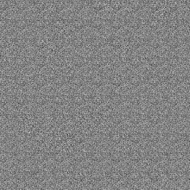
</p>

### Context Encoder
_Context Encoders: Feature Learning by Inpainting_

#### Authors
Deepak Pathak, Philipp Krahenbuhl, Jeff Donahue, Trevor Darrell, Alexei A. Efros

[[Paper]](https://arxiv.org/abs/1604.07379) [[Code]](models/context_encoder/context_encoder.py)

#### Run Example
```
$ cd models/context_encoder/
<follow steps at the top of context_encoder.py>
$ python3.7 context_encoder.py
```

<p align="center">
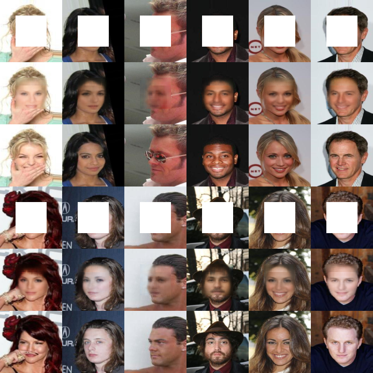
</p>
<p align="center">
    Rows: Masked | Inpainted | Original | Masked | Inpainted | Original
</p>

### Coupled GAN
_Coupled Generative Adversarial Networks_

#### Authors
Ming-Yu Liu, Oncel Tuzel

[[Paper]](https://arxiv.org/abs/1606.07536) [[Code]](models/cogan/cogan.py)

#### Run Example
```
$ download mnistm.pkl from https://cloud.tsinghua.edu.cn/f/d9a411da271745fcbe1f/?dl=1 and put it into data/mnistm/mnistm.pkl
$ cd models/cogan/
$ python3.7 cogan.py
```

<p align="center">
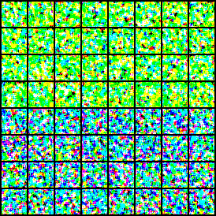
</p>
<p align="center">
    Generated MNIST and MNIST-M images
</p>

### CycleGAN
_Unpaired Image-to-Image Translation using Cycle-Consistent Adversarial Networks_

#### Authors
Jun-Yan Zhu, Taesung Park, Phillip Isola, Alexei A. Efros

[[Paper]](https://arxiv.org/abs/1703.10593) [[Code]](models/cyclegan/cyclegan.py)

#### Run Example
```
$ cd data/
$ bash download_cyclegan_dataset.sh monet2photo
$ cd ../models/cyclegan/
$ python3.7 cyclegan.py --dataset_name monet2photo
```

<p align="center">
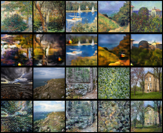
</p>
<p align="center">
    Monet to photo translations.
</p>

### Deep Convolutional GAN
_Deep Convolutional Generative Adversarial Network_

#### Authors
Alec Radford, Luke Metz, Soumith Chintala

[[Paper]](https://arxiv.org/abs/1511.06434) [[Code]](models/dcgan/dcgan.py)

#### Run Example
```
$ cd models/dcgan/
$ python3.7 dcgan.py
```

<p align="center">
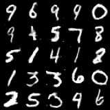
</p>

### DRAGAN
_On Convergence and Stability of GANs_

#### Authors
Naveen Kodali, Jacob Abernethy, James Hays, Zsolt Kira

[[Paper]](https://arxiv.org/abs/1705.07215) [[Code]](models/dragan/dragan.py)

#### Run Example
```
$ cd models/dragan/
$ python3.7 dragan.py
```

<p align="center">
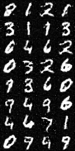
</p>

### Energy-Based GAN
_Energy-based Generative Adversarial Network_

#### Authors
Junbo Zhao, Michael Mathieu, Yann LeCun

[[Paper]](https://arxiv.org/abs/1609.03126) [[Code]](models/ebgan/ebgan.py)

#### Run Example
```
$ cd models/ebgan/
$ python3.7 ebgan.py
```

<p align="center">
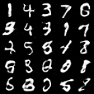
</p>

### Enhanced Super-Resolution GAN

_ESRGAN: Enhanced Super-Resolution Generative Adversarial Networks_

#### Authors
Xintao Wang, Ke Yu, Shixiang Wu, Jinjin Gu, Yihao Liu, Chao Dong, Chen Change Loy, Yu Qiao, Xiaoou Tang

[[Paper]](https://arxiv.org/abs/1809.00219) [[Code]](models/esrgan/esrgan.py)


#### Run Example
```
$ cd models/esrgan/
<follow steps at the top of esrgan.py>
$ python3.7 esrgan.py
```

<p align="center">

</p>

### GAN
_Generative Adversarial Network_

#### Authors
Ian J. Goodfellow, Jean Pouget-Abadie, Mehdi Mirza, Bing Xu, David Warde-Farley, Sherjil Ozair, Aaron Courville, Yoshua Bengio

[[Paper]](https://arxiv.org/abs/1406.2661) [[Code]](models/gan/gan.py)

#### Run Example
```
$ cd models/gan/
$ python3.7 gan.py
```

<p align="center">
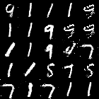
</p>

### InfoGAN
_InfoGAN: Interpretable Representation Learning by Information Maximizing Generative Adversarial Nets_

#### Authors
Xi Chen, Yan Duan, Rein Houthooft, John Schulman, Ilya Sutskever, Pieter Abbeel

[[Paper]](https://arxiv.org/abs/1606.03657) [[Code]](models/infogan/infogan.py)

#### Run Example
```
$ cd models/infogan/
$ python3.7 infogan.py
```
<p align="center">
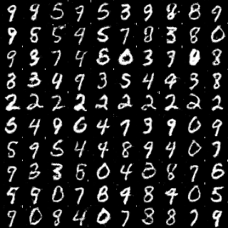
</p>
<p align="center">
    Result of varying continuous latent variable by row.
</p>

### Least Squares GAN
_Least Squares Generative Adversarial Networks_

#### Authors
Xudong Mao, Qing Li, Haoran Xie, Raymond Y.K. Lau, Zhen Wang, Stephen Paul Smolley

[[Paper]](https://arxiv.org/abs/1611.04076) [[Code]](models/lsgan/lsgan.py)

#### Run Example
```
$ cd models/lsgan/
$ python3.7 lsgan.py
```

<p align="center">
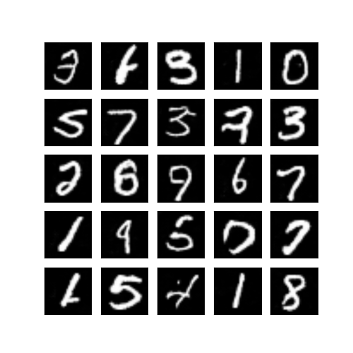
</p>

### Pix2Pix

_Unpaired Image-to-Image Translation with Conditional Adversarial Networks_

#### Authors
Phillip Isola, Jun-Yan Zhu, Tinghui Zhou, Alexei A. Efros

[[Paper]](https://arxiv.org/abs/1611.07004) [[Code]](models/pix2pix/pix2pix.py)

#### Run Example
```
$ cd data/
$ bash download_pix2pix_dataset.sh facades
$ cd ../models/pix2pix/
$ python3.7 pix2pix.py --dataset_name facades
```

<p align="center">
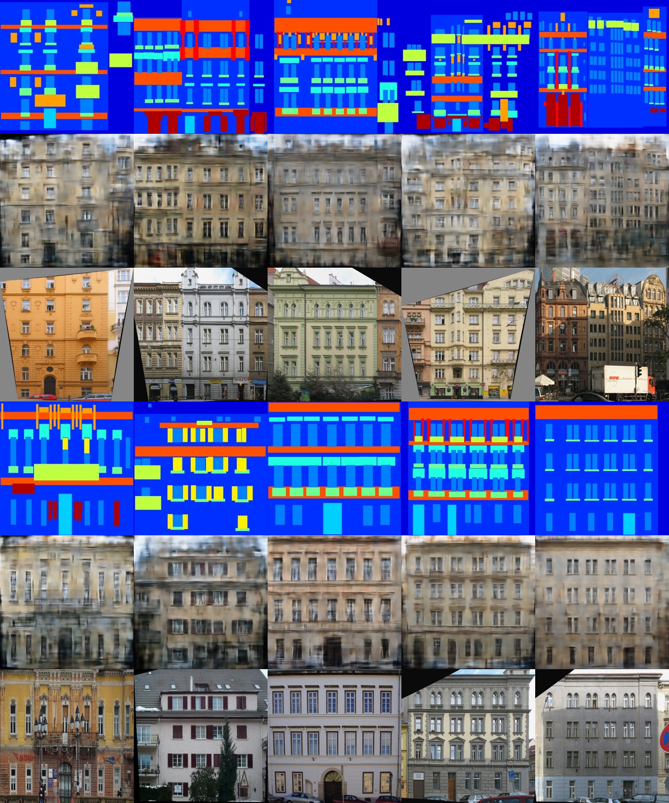
</p>

<p align="center">

```
Rows from top to bottom: (1) The condition for the generator (2) Generated image <br>
based of condition (3) The true corresponding image to the condition
```

</p>

### PixelDA

_Unsupervised Pixel-Level Domain Adaptation with Generative Adversarial Networks_

#### Authors
Konstantinos Bousmalis, Nathan Silberman, David Dohan, Dumitru Erhan, Dilip Krishnan

[[Paper]](https://arxiv.org/abs/1612.05424) [[Code]](models/pixelda/pixelda.py)

#### MNIST to MNIST-M Classification
Trains a classifier on images that have been translated from the source domain (MNIST) to the target domain (MNIST-M) using the annotations of the source domain images. The classification network is trained jointly with the generator network to optimize the generator for both providing a proper domain translation and also for preserving the semantics of the source domain image. The classification network trained on translated images is compared to the naive solution of training a classifier on MNIST and evaluating it on MNIST-M. The naive model manages a 55% classification accuracy on MNIST-M while the one trained during domain adaptation achieves a 95% classification accuracy.

```
$ download mnistm.pkl from https://cloud.tsinghua.edu.cn/f/d9a411da271745fcbe1f/?dl=1 and put it into data/mnistm/mnistm.pkl
$ cd models/pixelda/
$ python3.7 pixelda.py
```

<p align="center">
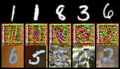
</p>
<p align="center">
    Rows from top to bottom: (1) Real images from MNIST (2) Translated images from <br>
    MNIST to MNIST-M (3) Examples of images from MNIST-M
</p>

### Relativistic GAN
_The relativistic discriminator: a key element missing from standard GAN_

#### Authors
Alexia Jolicoeur-Martineau

[[Paper]](https://arxiv.org/abs/1807.00734) [[Code]](models/relativistic_gan/relativistic_gan.py)

#### Run Example
```
$ cd models/relativistic_gan/
$ python3.7 relativistic_gan.py                 # Relativistic Standard GAN
$ python3.7 relativistic_gan.py --rel_avg_gan   # Relativistic Average GAN
```

<p align="center">
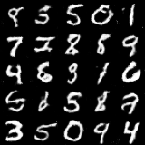
</p>

### Semi-Supervised GAN

_Semi-Supervised Generative Adversarial Network_

#### Authors
Augustus Odena

[[Paper]](https://arxiv.org/abs/1606.01583) [[Code]](models/sgan/sgan.py)

#### Run Example
```
$ cd models/sgan/
$ python3.7 sgan.py
```

### Softmax GAN
_Softmax GAN_

#### Authors
Min Lin

[[Paper]](https://arxiv.org/abs/1704.06191) [[Code]](models/softmax_gan/softmax_gan.py)

#### Run Example
```
$ cd models/softmax_gan/
$ python3.7 softmax_gan.py
```

<p align="center">
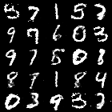
</p>

### StarGAN

_StarGAN: Unified Generative Adversarial Networks for Multi-Domain Image-to-Image Translation_

#### Authors
Yunjey Choi, Minje Choi, Munyoung Kim, Jung-Woo Ha, Sunghun Kim, Jaegul Choo

[[Paper]](https://arxiv.org/abs/1711.09020) [[Code]](models/stargan/stargan.py)

#### Run Example
```
$ cd models/stargan/
<follow steps at the top of stargan.py>
$ python3.7 stargan.py
```

<p align="center">
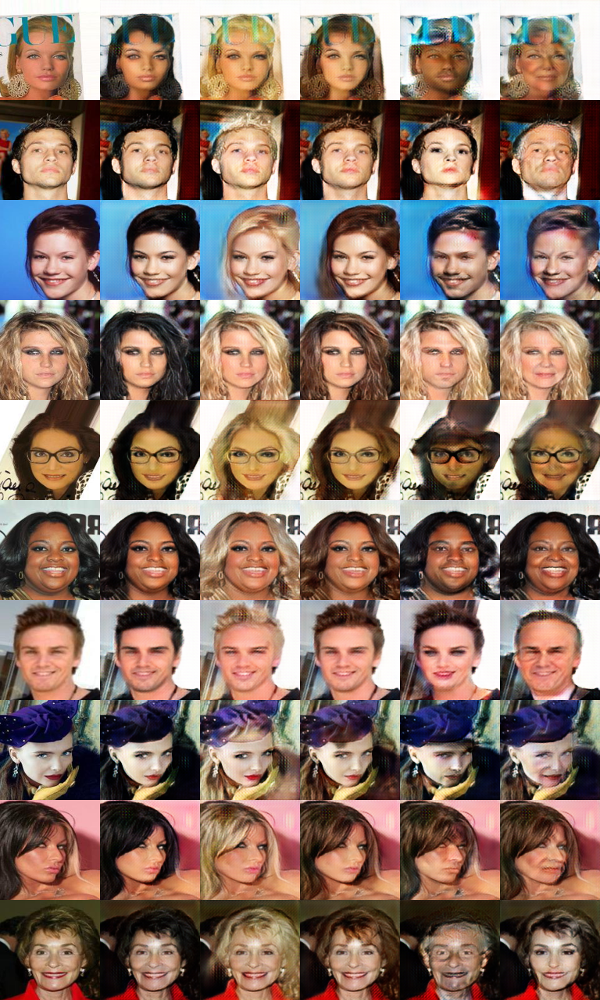
</p>

<p align="center">

    Original | Black Hair | Blonde Hair | Brown Hair | Gender Flip | Aged
</p>

### UNIT
_Unsupervised Image-to-Image Translation Networks_

#### Authors
Ming-Yu Liu, Thomas Breuel, Jan Kautz

[[Paper]](https://arxiv.org/abs/1703.00848) [[Code]](models/unit/unit.py)

#### Run Example
```
$ cd data/
$ bash download_cyclegan_dataset.sh apple2orange
$ cd models/unit/
$ python3.7 unit.py --dataset_name apple2orange
```

### Wasserstein GAN
_Wasserstein GAN_

#### Authors
Martin Arjovsky, Soumith Chintala, Léon Bottou

[[Paper]](https://arxiv.org/abs/1701.07875) [[Code]](models/wgan/wgan.py)

#### Run Example
```
$ cd models/wgan/
$ python3.7 wgan.py
```

<p align="center">
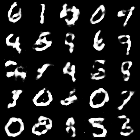
</p>

### Wasserstein GAN GP

_Improved Training of Wasserstein GANs_

#### Authors
Ishaan Gulrajani, Faruk Ahmed, Martin Arjovsky, Vincent Dumoulin, Aaron Courville

[[Paper]](https://arxiv.org/abs/1704.00028) [[Code]](models/wgan_gp/wgan_gp.py)

#### Run Example
```
$ cd models/wgan_gp/
$ python3.7 wgan_gp.py
```

<p align="center">
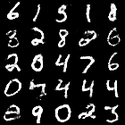
</p>

### Wasserstein GAN DIV

_Wasserstein Divergence for GANs_

#### Authors
Jiqing Wu, Zhiwu Huang, Janine Thoma, Dinesh Acharya, Luc Van Gool

[[Paper]](https://arxiv.org/abs/1712.01026) [[Code]](models/wgan_div/wgan_div.py)

#### Run Example
```
$ cd models/wgan_div/
$ python3.7 wgan_div.py
```

<p align="center">
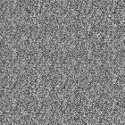
</p>
